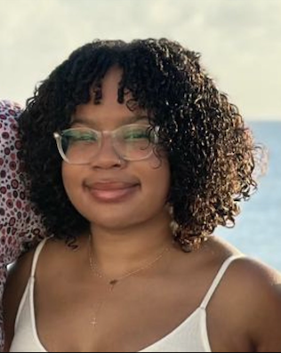

## Hello there 👋

My name is **Gabrielle (Gabby) Ritchie**   and I was born and raised in the *Bahamas* 🌞🐚🌴.
### Pronouns 
She/Her

### What am I studying? 🤔📓🎓
I am currently in my **third year** of a **Bachelor of Science major in Psychology** at *Dalhousie University*. 
### Why Did I Choose To Take The Course Neural Data Science? 
I enrolled in this class because I was interested in learning the data science used for the brain, specifically in relation to EEGs and other neural scans. As well as that, I am **not** experienced in coding in the slightest and it always seemed overwhelming  to me so I also chose this course as it would be a nice *challenge* as it's something outside of my comfort zone. 
### Why Psychology? 
I decided to pursue a degree in psychology as the subject always interested me, especially the psychopathology aspect of it, and I would like to add to the small number of psychologists in the Bahamas and help advocate for and help those with mental illnesses.  
### My Future Plans ⌛
- Complete a Masters Degree in Clinical Psychology
- Complete a PhD in Clinical Psychology 

### How To Reach Me 
My email is **gb979033@dal.ca**
<!--
**gb979033/gb979033** is a ✨ _special_ ✨ repository because its `README.md` (this file) appears on your GitHub profile.

Here are some ideas to get you started:

- 🔭 I’m currently working on ...
- 🌱 I’m currently learning ...
- 👯 I’m looking to collaborate on ...
- 🤔 I’m looking for help with ...
- 💬 Ask me about ...
- 📫 How to reach me: ...
- 😄 Pronouns: ...
- ⚡ Fun fact: ...
-->
